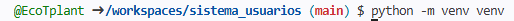
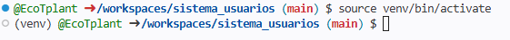
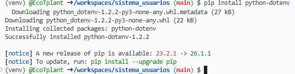
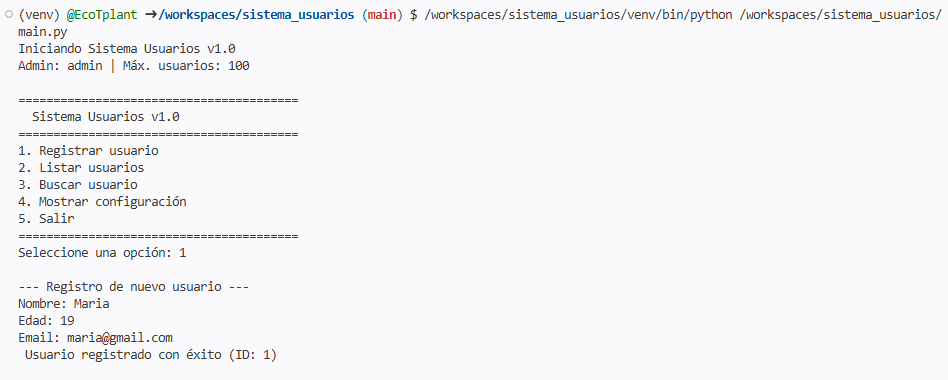
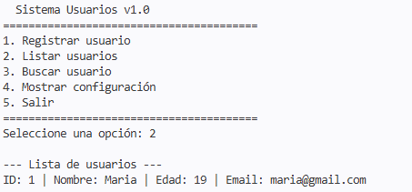
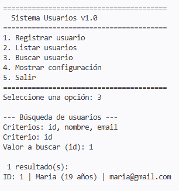
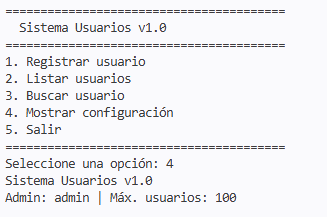
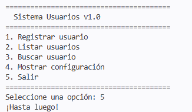
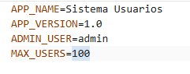

# Sistema Modular de Configuración y Gestión de Usuarios

Aplicación de consola en Python que permite gestionar usuarios (registro, listado, búsqueda) con una arquitectura modular, uso de variables de entorno, manejo de excepciones y buenas prácticas.

## Requisitos previos

- Python 3.8 o superior instalado.
- `pip` actualizado (opcional).
- Git (opcional, para clonar).

## Instalación y ejecución

###  Clonar o descargar el proyecto

```bash
git clone https://github.com/tuusuario/sistema_usuarios.git
cd sistema_usuarios

```

### Creación y activación de entorno virtual




### Instalación de dependencias



### Ejecucion del programa







### Configuración variables de entorno

Editar el archivo .env (ya incluido en el proyecto) con los valores deseados, como se muestra en el archivo .env.example:



### Estructura del proyecto y explicación de módulos

sistema_usuarios/
├── app/                     # Paquete principal
│   ├── config/              # Configuración
│   │   ├── __init__.py
│   │   └── settings.py      # Carga y expone variables de entorno
│   └── usuarios/            # Lógica de usuarios
│       ├── __init__.py
│       ├── gestor.py        # CRUD de usuarios
│       └── validaciones.py  # Funciones de validación
├── .env                     # Variables de entorno (no subir a Git)
├── main.py                  # Punto de entrada (menú consola)
├── requirements.txt         # Dependencias
└── README.md                # Este archivo

### Módulos y paquetes
## Paquete app:
Contiene toda la lógica de la aplicación.

## Subpaquete config:
Maneja la configuración desde variables de entorno.

## Subpaquete usuarios:
Encapsula las operaciones relacionadas con usuarios.

## Módulo settings.py:
Usa python-dotenv para cargar el archivo .env y ofrece una clase Settings.

## Módulo validaciones.py:
Funciones reutilizables para validar nombres, edades, emails y unicidad.

## Módulo gestor.py: Clase
GestorUsuarios con métodos para registrar, listar y buscar.

### Uso de variables de entorno
Las variables de entorno se definen en el archivo .env y se cargan mediante python-dotenv. El módulo settings.py las convierte en atributos de la clase Settings, permitiendo un acceso centralizado y tipado.

### Manejo de errores
Las validaciones lanzan excepciones ValueError con mensajes descriptivos.

El main.py captura estas excepciones y muestra mensajes amigables.

Se controla el límite máximo de usuarios según MAX_USERS.
